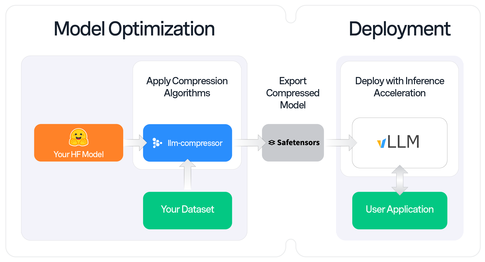

# LLM Compressor
`llm-compressor` is an easy-to-use library for optimizing models for deployment with `vllm`, including:

* Comprehensive set of quantization algorithms including weight-only and activation quantization
* Seamless integration Hugging Face models and repositories
* `safetensors`-based file format compatible with `vllm`
* Large model support via `accelerate`

<p align="center">
   
</p>


### Supported Formats:
* Activation Quantization: W8A8 (`int8` and `fp8`)
* Mixed Precision: W4A16, W8A16
* 2:4 Semi-structured Sparsity
* Unstructured Sparsity

### Supported Algorithms:
* PTQ (Post Training Quantization)
* GPTQ
* SmoothQuant
* SparseGPT


## Installation

`llm-compressor` can be installed from the source code via a git clone and local pip install.

### From PyPI
```bash
pip install llmcompressor
```

### From Source
```bash
git clone https://github.com/vllm-project/llm-compressor.git
pip install -e llm-compressor
```

## Quick Tour
The following snippet is a minimal example with 4-bit weight-only quantization via GPTQ and inference of a `TinyLlama/TinyLlama-1.1B-Chat-v1.0`. Note that the model can be swapped for a local or remote HF-compatible checkpoint and the `recipe` may be changed to target different quantization algorithms or formats.

### Compression
Compression is easily applied by selecting an algorithm (GPTQ) and calling the `oneshot` API.

```python
from llmcompressor.transformers import oneshot
from llmcompressor.modifiers.quantization.gptq import GPTQModifier

# Sets parameters for the GPTQ algorithms - target Linear layer weights at 4 bits
recipe = GPTQModifier(scheme="W4A16", targets="Linear", ignore=["lm_head"])

# Apply GPTQ algorithm using open_platypus dataset for calibration.
oneshot(
    model="TinyLlama/TinyLlama-1.1B-Chat-v1.0",
    dataset="open_platypus",
    recipe=recipe,
    save_compressed=True,
    output_dir="llama-compressed-quickstart",
    overwrite_output_dir=True,
    max_seq_length=2048,
    num_calibration_samples=512,
)
```

### Inference with vLLM
The checkpoint is ready to run with vLLM (after install `pip install vllm>=0.5.4`).

```python
from vllm import LLM

model = LLM("llama-compressed-quickstart")
output = model.generate("I love 4 bit models because")
```

## Examples

See below for end-to-end examples applying quantization with `llmcompressor`:
* [`Meta-Llama-3-8B-Instruct` W8A8-INT8 With GPTQ and SmoothQuant](examples/quantization_w8a8_int8)
* [`Meta-Llama-3-8B-Instruct` W8A8-FP8 With PTQ](examples/quantization_w8a8_fp8)
* [`Meta-Llama-3-8B-Instruct` W4A16 With GPTQ](examples/quantization_w4a16)

## User Guides
See below for deep dive user guides into key topics related to using `llmcompressor`:
* [Quantizing with large models with the help of `accelerate`](examples/big_models_with_accelerate)


If you have any questions or requests open an [issue](https://github.com/vllm-project/llm-compressor/issues) and we will add an example or documentation.

## Contribute
We appreciate contributions to the code, examples, integrations, and documentation as well as bug reports and feature requests!
[Learn how here](CONTRIBUTING.md).
