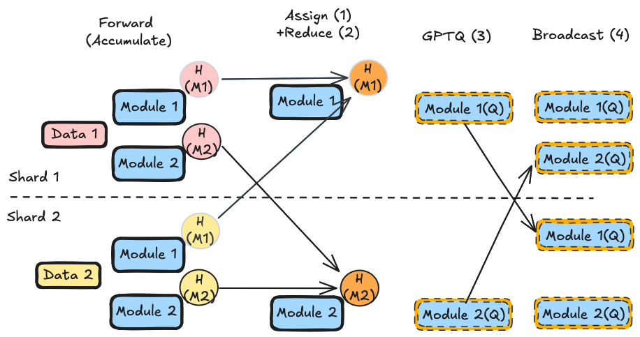
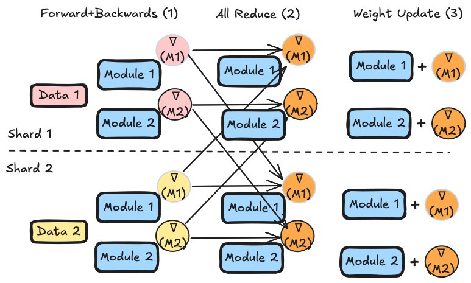
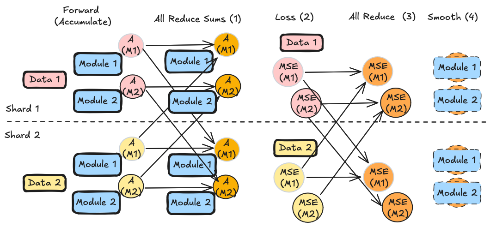

## Distributed Oneshot ##
LLM Compressor supports distributed oneshot to greatly speed up model calibration and compression. Each rank processes a disjoint partition of the calibration dataset (data-parallel calibration); modifiers then synchronize statistics across ranks so all ranks produce identical quantization parameters. For the GPTQ modifier, compression itself is also distributed: modules are assigned to ranks by a greedy bin-packing algorithm and the compressed weights are broadcast back. For more information on the design, see [[RFC] [Performance Refactor][Distributed] Sequential Onloading with Data-Parallel Calibration and Weight-Parallel Optimization](https://github.com/vllm-project/llm-compressor/issues/2180) as well as [[GPTQ][ddp] enabling DDP for GPTQ](https://github.com/vllm-project/llm-compressor/pull/2333).

## Usage ##
In order to convert a script meant for single-threaded compression into one of distributed compression, please make the following changes:

### 1. Initialize the Distributed Context ###

In order to utilize the `torch.distributed` module, each rank must initialize the distributed module and assign itself a separate GPU device. This can be done by calling the `init_dist` utility provided by `compressed_tensors`. 

```python
from compressed_tensors.offload import init_dist

init_dist()
```

### 2. Modify Model Loading ###

In order to prevent separate processes from loading the model multiple times and creating excess work/memory usage, we must load our model using the `load_offloaded_model` context. For more information, see [Model Loading](./model_loading.md#distributed-oneshot).

Before:
```python
model = AutoModelForCausalLM.from_pretrained(
    model_id,
    dtype="auto"
)
```

After:
```python
from compressed_tensors.offload import load_offloaded_model

with load_offloaded_model():
    model = AutoModelForCausalLM.from_pretrained(
        model_id,
        dtype="auto",
        device_map="auto_offload",
    )
```

### 3. Modify Dataset Loading ###

In order to prevent separate processes loading the entire dataset and creating excess work/memory usage, we must partition our dataset into disjoint sets. For a dataset of *N* samples and *R* ranks, each rank only loads *N/R* samples.

```python
ds = load_dataset(
    DATASET_ID, split=f"{DATASET_SPLIT}[:{NUM_CALIBRATION_SAMPLES}]"
)
```


```python
from llmcompressor.datasets.utils import get_rank_partition

ds = load_dataset(
    DATASET_ID, split=get_rank_partition(DATASET_SPLIT, NUM_CALIBRATION_SAMPLES)
)
```

Alternatively, if you pass a `Dataset` object directly to `oneshot`, the sampler automatically detects when all ranks have the same dataset (via fingerprint comparison) and partitions it across ranks for you — no manual partitioning needed in that case.

### 4. Call your script with `torchrun` ###

Now, your script is ready to run using distributed processes. To start, simply run your script using `torchrun --nproc_per_node=2 YOUR_EXAMPLE.py` to run with two GPU devices.

### 5. Post-quantization: Sample Generation and Save ###

After `oneshot` returns, you can perform sample generation to verify that everything worked as expected and model output looks sane. If the model is small enough, you can speed up sample generation by dispatching to GPU before running generation with `dispatch_model`. If the model is not small enough, it will remain offloaded.

```python
dispatch_model(model)
sample = tokenizer("Hello my name is", return_tensors="pt")
sample = {key: value.to(model.device) for key, value in sample.items()}
output = model.generate(**sample, max_new_tokens=100)
```

For larger models, consider skipping this step or using just a few tokens, as onloading offloaded weights can take a long time.

To save the model, `save_pretrained` handles distributed internals automatically — only rank 0 writes to disk. You should still call it from all ranks and call `destroy_process_group()` at the end:

```python
import torch.distributed as dist

model.save_pretrained(SAVE_DIR, save_compressed=True)
tokenizer.save_pretrained(SAVE_DIR)

dist.destroy_process_group()
```

## Quantization Modifier DDP Support ##

The following quantization modifiers are DDP-aware. Each section describes its synchronization strategy.

### QuantizationModifier ###
Since weight information is the same across ranks we only have to synchronize activation information and activation information is only needed in 2 cases for the QuantizationModifier. Case 1: when doing non-dynamic activation quantization like FP8 (static activation quantization) and NVFP4 (local activation quantization) quantization schemes. Case 2: when using a weight observer that makes use of activation information like the iMatrixObserver.

In both cases, activation information is **all-reduced across ranks at sequential layer boundaries** — so all ranks share identical quantization parameters before moving to the next layer. The reduce operation varies by observer type (see [Observer DDP support](#observer-ddp-support) below). Thus while the calibration is parallelized, the actual compression happens identically across all ranks after any activation statistics have been synchrnized.

### GPTQModifier ###

GPTQ, being a more expensive technique, can make further use of parallelization by doing weight-parallel compression. Once rank has accumulated a partial Hessian for every module during the forward pass on its data partition, the modifier then:

1. Uses a greedy bin-packing algorithm to assign each module to exactly one "source" rank (balanced by Hessian size).
2. For each module, all ranks send their partial Hessian to the owner rank via dist.reduce (SUM), giving the owner the full dataset's Hessian.
3. Each owner rank compresses its assigned modules independently (avoiding redundant computation across ranks).
4. Compressed parameters (`weight`, `weight_scale`, `weight_zero_point`) are broadcast back to all ranks via `dist.broadcast`.



This means compression itself is parallelized across ranks, not just calibration.

See [llama3_ddp_example.py](https://github.com/vllm-project/llm-compressor/blob/main/examples/quantization_w4a16/llama3_ddp_example.py) for a complete W4A16 example.

**Benchmark results** (as of LLM Compressor v0.10.0):

| model_id | world_size | max_time | max_memory | save_time | flex_extract | eval_time |
|----------|-------------|----------|------------|-----------|--------------|-----------|
| Meta-Llama-3-8B-Instruct |  1 | 745.03 | 5.82 | 19.57 | 0.7066 | 95.28 |
| Meta-Llama-3-8B-Instruct | 2 | 372.20 | 5.57 | 49.10 | 0.7089 | 95.24 |
| Meta-Llama-3-8B-Instruct | 4 | 264.07 | 5.82 | 52.50 | 0.7180 | 96.74 |
| Qwen3-30B-A3B | 1 | 14207.53 | 6.56 | 748.23 | 0.8704 | 209.93 |
| Qwen3-30B-A3B | 2 | 7018.25 | 6.36 | 696.65 | 0.8810 | 205.89 |
| Qwen3-30B-A3B | 4 | 3694.46 | 6.36 | 723.05 | 0.8832 | 217.62 |

### AutoRoundModifier ###

AutoRound defines a 3rd archetype of modifier as far as DDP support. Because the compression step repeatedly uses the actual activations which are sharded across ranks, Autoround uses a kind of data-parallel synchronized compression in contrast to GPTQ's weight-parallel or QuantizationModifier's identical-across-ranks compression. During calibration the inputs to each module are recorded, from there:

1. For each module, for some number of iterations, quantize the weight and then do a forward and a (modified) backward pass (using the recorded module inputs) to obtain gradients (SignSGD)
2. synchronize gradients across ranks using `dist.all_reduce` (SUM)
3. Each rank independently updates the weights and then repeats



In general this process is handled internally within Autoround.

See [ddp_qwen3_example.py](https://github.com/vllm-project/llm-compressor/blob/main/examples/autoround/ddp/ddp_qwen3_example.py) for a complete example.

## Transform Modifier DDP Support ##

Transform modifiers (which rescale weights and activations before quantization) are also DDP-aware. Each section describes its synchronization strategy.

### SmoothQuantModifier ###

SmoothQuant uses **all-reduce of per-channel activation statistics** across ranks similar to the QuantizationModifier. Each rank observes its partition of the calibration data to collect per-channel min/max values. Before smoothing scales are computed, `dist.all_reduce` (with MIN/MAX ops) ensures every rank has the global per-channel statistics. The smoothing scale computation is then performed independently and identically on each rank — no broadcast of the final weight tensors is needed.

See [smoothquant_ddp_example.py](https://github.com/vllm-project/llm-compressor/blob/main/examples/quantization_w8a8_int8/smoothquant_ddp_example.py) for a complete W8A8 + SmoothQuant example.

### AWQModifier ###

AWQ is similar to Autoround, since it uses the actual sharded activations during compression it uses a kind of synchronous data-parallel compression though unlike Autoround, it requires a GPTQ-esque initial sync of activation statistics. During calibration, the AWQModifier records activation sums for the portion of data seen by each rank. The modifier then:

1. uses `dist.all_reduce` (SUM) to synchronize activation sums across all ranks. (sums are used to pick potential scales)
2. For each module, for each potential scale, each rank calculates module output for its data partition and calulates a partial MSE against the output of the non quantized module. 
3. This partial MSE is synchronized for all ranks using `dist.all_reduce` (SUM) and this is repeated until the scale with the best MSE is found
4. Each rank indepedently smoothes its modules using the best scale which will be the same for all ranks.



AWQ does smoothing independently on all ranks which differs from GPTQ's parallel compression approach. This is because the primary cost of AWQ is the loss computation across the whole data (which is parallelized) while the smoothing operation is just a single elementwise multiplication.

See [llama_example_ddp.py](https://github.com/vllm-project/llm-compressor/blob/main/examples/awq/llama_example_ddp.py) for a LLaMA W4A16 example, and [qwen3_moe_example_ddp.py](https://github.com/vllm-project/llm-compressor/blob/main/examples/awq/qwen3_moe_example_ddp.py) for a Qwen3-MoE example.

## Observer DDP Support ##

Observers (used during activation calibration) expose a `sync_activation_stats()` method that all-reduces their accumulated statistics across DDP ranks. Each observer class declares which statistics to sync and with what reduce operation via the `_act_sync_dict` class attribute:

| Observer | Synced statistics | Reduce op |
|----------|-------------------|-----------|
| `static_minmax` | `min_vals`, `max_vals` | MIN, MAX |
| `minmax` (EMA) | `min_vals`, `max_vals` | AVG |
| `memoryless_minmax` | *(none — data-free)* | — |
| `mse` (EMA) | `min_vals`, `max_vals` | AVG |
| `memoryless_mse` | *(none — data-free)* | — |
| `imatrix_mse` | `_imatrix_sum`, `_imatrix_count` | SUM |

Weight statistics are never synced: weights are identical across ranks (broadcast at load time), so only activation-derived statistics need synchronization.

The `QuantizationMixin.sync_obs_act_stats()` method (called at each sequential layer boundary) iterates all observers on the modules in the current subgraph and calls `observer.sync_activation_stats()`, collecting async communication handles and waiting for completion before proceeding to the next layer.

## DDP Support - General Framework

In general, the DDP implementation is designed to affect as few abstractions as possible to reduce complication and ease maintenance. While modifiers have to be generally DDP-aware and observers provide an interface that modifiers can use to synchronize activation statistics, the rest of llm-compressor is largely DDP agnostic. Things like the sequential pipeline are entirely blind to whether or not DDP is being used. While a few areas like saving and data preparation include some DDP-awareness to avoid foot-guns, these instances are rare and the system will work without them.

## Complete Example Scripts ##

| Algorithm | Example |
|-----------|---------|
| GPTQ W4A16 | [llama3_ddp_example.py](https://github.com/vllm-project/llm-compressor/blob/main/examples/quantization_w4a16/llama3_ddp_example.py) |
| SmoothQuant + GPTQ W8A8 | [smoothquant_ddp_example.py](https://github.com/vllm-project/llm-compressor/blob/main/examples/quantization_w8a8_int8/smoothquant_ddp_example.py) |
| AWQ + QuantizationModifier W4A16 (LLaMA) | [llama_example_ddp.py](https://github.com/vllm-project/llm-compressor/blob/main/examples/awq/llama_example_ddp.py) |
| AWQ + QuantizationModifier W4A16 (Qwen3 MoE) | [qwen3_moe_example_ddp.py](https://github.com/vllm-project/llm-compressor/blob/main/examples/awq/qwen3_moe_example_ddp.py) |
| AutoRound W4A16 | [ddp_qwen3_example.py](https://github.com/vllm-project/llm-compressor/blob/main/examples/autoround/ddp/ddp_qwen3_example.py) |
