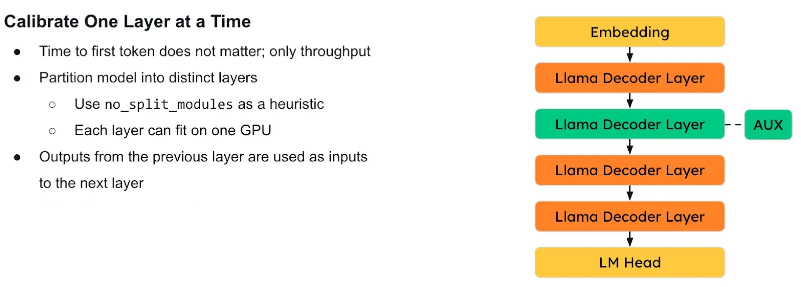
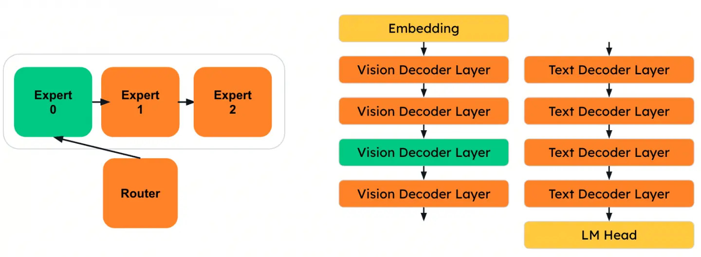

# Sequential Onloading #

## Introduction ##

LLM Compressor is capable of compressing models much larger than the amount of memory available as VRAM. This is achieved through a technique called **sequential onloading** whereby only a fraction of the model weights are moved to GPU memory for calibration while the rest of the weights remain offloaded to CPU or disk. When performing calibration, the entire dataset is offloaded to CPU, then onloaded one batch at a time to reduce peak activations memory usage.



If basic calibration/inference is represented with the following pseudo code...
```python
for i in range(len(activations)):
    for layer in model.layers:
        activations[i] = layer(activations[i])
```

Then sequential onloading is the technique by which the order of the two for loops is swapped.
```python
for layer in model.layers:
    for i in range(len(activations)):
        dataset[i] = layer(dataset[i])
```

## Implementation ##

Before a model can be sequentially onloaded, it must first be broken up into disjoint parts which can be individually onloaded. This is achieved through the [torch.fx.Tracer](https://github.com/pytorch/pytorch/blob/main/torch/fx/README.md#tracing) module, which allows a model to be represented as a graph of operations (nodes) and data inputs (edges). Once the model has been traced into a valid graph representation, the graph is cut (partitioned) into disjoint subgraphs, each of which is onloaded individually as a layer. This implementation can be found [here](https://github.com/vllm-project/llm-compressor/blob/main/src/llmcompressor/pipelines/sequential/helpers.py).


*This image depicts some of the operations performed when executing the Llama3.2-Vision model*


*This image depicts the sequential text decoder layers of the Llama3.2-Vision model. Each of the individual decoder layers is onloaded separately*

## Sequential Targets and Usage ##
You can use sequential onloading by calling `oneshot` with the `pipeline="sequential"` argument. Note that this pipeline is the default for all oneshot calls which require calibration data. If the sequential pipeline proves to be problematic, you can specify `pipeline="basic"` to use a basic pipeline which does not require sequential onloading, but only works performantly when the model is small enough to fit into the available VRAM.

If you are compressing a model using a GPU with a small amount of memory, you may need to change your sequential targets. Sequential targets control how many weights to onload to the GPU at a time. By default, the sequential targets are decoder layers which may include large MoE layers. In these cases, setting the `sequential_targets="Linear"` argument in `oneshot` will result in lower VRAM usage, but a longer runtime.



## More information ##

For more information, see the [RedHat AI blog post](https://developers.redhat.com/articles/2025/05/09/llm-compressor-optimize-llms-low-latency-deployments#generalizing_to_multimodal_and_moe_architectures) or the [LLM Compressor Office Hours Recording](https://www.youtube.com/watch?v=GrhuqQDmBk8).