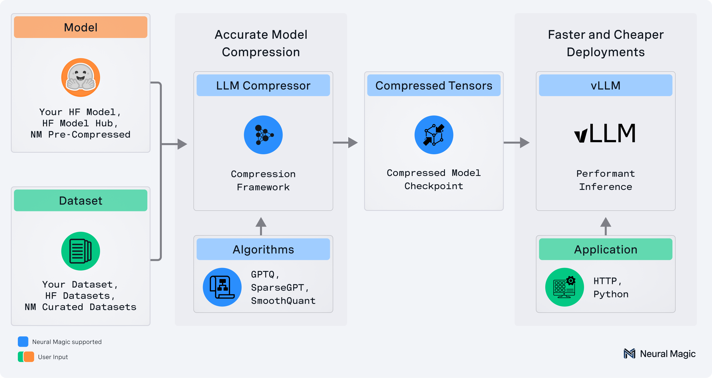

# About LLM Compressor

**LLM Compressor** is an easy-to-use library for optimizing large language models for deployment with vLLM, enabling up to **5X faster, cheaper inference**. It provides a comprehensive toolkit for:

- Applying a wide variety of compression algorithms, including weight and activation quantization, pruning, and more
- Seamlessly integrating with Hugging Face Transformers, Models, and Datasets 
- Using a `safetensors`-based file format for compressed model storage that is compatible with `vLLM`
- Supporting performant compression of large models via `accelerate`

## 
 LLM Compressor

   

## New in this release

Review the [LLM Compressor v0.8.0 release notes](https://github.com/vllm-project/llm-compressor/releases/tag/0.8.0) for details about new features. Highlights include:

!!! info "Support for multiple modifiers in oneshot compression runs"
    LLM Compressor now supports using multiple modifiers in oneshot compression runs such as applying both AWQ and GPTQ in a single model. 

    Using multiple modifiers is an advanced usage of LLM Compressor and an active area of research. See [Non-uniform Quantization](examples/quantization_non_uniform/) for more detail and example usage.

!!! info "Quantization and calibration support for Qwen3 models"
    Quantization and calibration support for Qwen3 Next models has been added to LLM Compressor.

    LLM Compressor now supports quantization for Qwen3 Next and Qwen3 VL MoE models. You can now use data-free pathways such as FP8 channel-wise and block-wise quantization. Pathways requiring data such W4A16 and NVFP4 are planned for a future release.

    Examples for NVFP4 and FP8 quantization have been added for the Qwen3-Next-80B-A3B-Instruct model. 

    For the Qwen3 VL MoE model, support has been added for the data-free pathway. The data-free pathway applies FP8 quantization, for example, channel-wise and block-wise quantization. 

    **NOTE**: These models are not supported in tranformers<=4.56.2. You may need to install transformers from source.

!!! info "Transforms support for non-full-size rotation sizes"
    You can now set a `transform_block_size` field in the Transform-based modifier classes `SpinQuantModifier` and `QuIPModifier`. You can configure transforms of variable size with this field, and you don't need to restrict hadamards to match the size of the weight.

## Recent Updates

!!! info "QuIP and SpinQuant-style Transforms" 
    The newly added [`QuIPModifier`](examples/transform/quip_example.py) and [`SpinQuantModifier`](examples/transform/spinquant_example.py) allow you to quantize models after injecting hadamard weights into the computation graph, reducing quantization error and greatly improving accuracy recovery for low bit-weight and activation quantization.

!!! info "DeepSeekV3-style Block Quantization Support" 
    Allows for more efficient compression of large language models without needing a calibration dataset. Quantize a Qwen3 model to [W8A8](examples/quantization_w8a8_fp8.md).

!!! info "FP4 Quantization - now with MoE and non-uniform support" 
    Quantize weights and activations to FP4 and seamlessly run the compressed model in vLLM. Model weights and activations are quantized following the [NVFP4 configuration](https://github.com/neuralmagic/compressed-tensors/blob/f5dbfc336b9c9c361b9fe7ae085d5cb0673e56eb/src/compressed_tensors/quantization/quant_scheme.py#L104). See examples of [FP4 activation support](examples/quantization_w4a4_fp4/llama3_example.py), [MoE support](examples/quantization_w4a4_fp4/qwen_30b_a3b.py), and [Non-uniform quantization support](examples/quantization_non_uniform) where some layers are selectively quantized to FP8 for better recovery. You can also mix other quantization schemes, such as INT8 and INT4.

!!! info "Llama4 Quantization Support"
    Quantize a Llama4 model to [W4A16](examples/quantization_w4a16.md) or [NVFP4](examples/quantization_w4a16.md). The checkpoint produced can seamlessly run in vLLM.

For more information, check out the [latest release on GitHub](https://github.com/vllm-project/llm-compressor/releases/latest).

## Key Features

- **Weight and Activation Quantization:** Reduce model size and improve inference performance for general and server-based applications with the latest research.
    - Supported Algorithms: GPTQ, AWQ, SmoothQuant, RTN
    - Supported Formats: INT W8A8, FP W8A8
- **Weight-Only Quantization:** Reduce model size and improve inference performance for latency sensitive applications with the latest research
    - Supported Algorithms: GPTQ, AWQ, RTN
    - Supported Formats: INT W4A16, INT W8A16
- **Weight Pruning:** Reduce model size and improve inference performance for all use cases with the latest research
    - Supported Algorithms: SparseGPT, Magnitude, Sparse Finetuning
    - Supported Formats: 2:4 (semi-structured), unstructured

## Key Sections

- :material-rocket-launch:{ .lg .middle } Getting Started

    ---

    Install LLM Compressor and learn how to apply your first optimization recipe.

    [:octicons-arrow-right-24: Getting started](./getting-started/)

- :material-book-open-variant:{ .lg .middle } Guides

    ---

    Detailed guides covering compression schemes, algorithms, and advanced usage patterns.

    [:octicons-arrow-right-24: Guides](./guides/)

- :material-flask:{ .lg .middle } Examples

    ---

    Step-by-step examples for different compression techniques and model types.

    [:octicons-arrow-right-24: Examples](./examples/)

- :material-tools:{ .lg .middle } Developer Resources

    ---

    Information for contributors and developers extending LLM Compressor.

    [:octicons-arrow-right-24: Developer Resources](./developer/)

