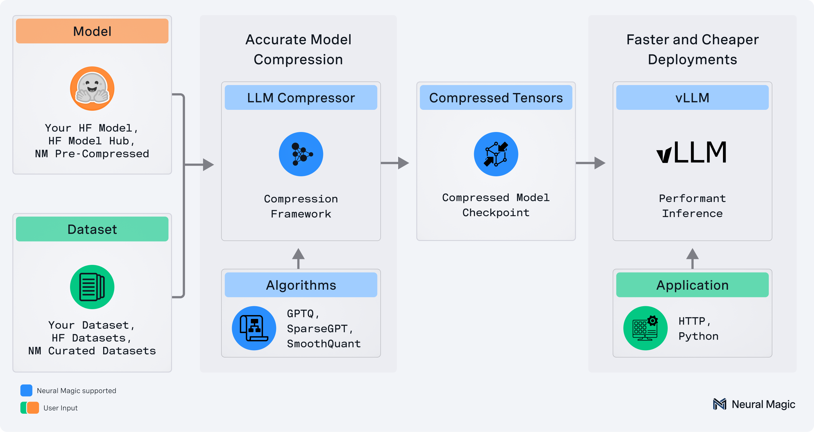

# What is LLM Compressor?

**LLM Compressor** is an easy-to-use library for optimizing large language models for deployment with vLLM. It provides a comprehensive toolkit for applying state-of-the-art compression algorithms to reduce model size, lower hardware requirements, and improve inference performance.

   

## Which challenges does LLM Compressor address?

Model optimization through quantization and pruning addresses the key challenges of deploying AI at scale:

| Challenge | How LLM Compressor helps |
|-----------|--------------------------|
| GPU and infrastructure costs | Reduces memory requirements by 50-75%, enabling deployment on fewer GPUs |
| Response latency | Reduces data movement overhead because quantized weights load faster |
| Request throughput | Utilizes lower-precision tensor cores for faster computation |
| Energy consumption | Smaller models consume less power during inference |

For more information, see [Why use LLM Compressor?](./steps/why-llmcompressor.md)

## New in this release

Review the [LLM Compressor v0.12.0 release notes](https://github.com/vllm-project/llm-compressor/releases/tag/0.12.0) for details about new features. New features to be aware of include:

- **Transformers v5 Upgrade**: Full integration with Transformers v5, including refactored MoE linearization with `load_context` for efficient loading, updated model structure handling, and improved tied embeddings support. LM eval performance is maintained across the transition. Note that LLM Compressor no longer supports installation with `transformers<5.0.0`

- **Simplified Dataset Interface**: Legacy multi-split dataset logic has been removed, replacing `splits={"calibration": "train[:100]"}` with a cleaner `split="train[:100]"` API. The new interface is backwards compatible, and usage of the old dictionary-based `splits` argument is deprecated and will be removed in a future release

- **Multi-GPU Model-Free PTQ**: `model_free_ptq` jobs can now be distributed across multiple GPUs when available, automatically parallelizing the quantization workflow for significant speedups on large models

- **Nemotron 3 Ultra Examples**: Model-free PTQ examples have been added for NVIDIA's Nemotron-3-Ultra-550B model, with pre-quantized FP8 checkpoints available on the HF Hub

## Supported algorithms and techniques

| Algorithm | Description | Use Case |
|-----------|-------------|----------|
| **RTN** (Round-to-Nearest) | Fast baseline quantization | Quick compression with minimal setup |
| **GPTQ** | Weighted quantization with calibration | High-accuracy 4 and 8 bit weight quantization |
| **AWQ** | Activation-aware weight quantization | Preserves accuracy for important weights |
| **SmoothQuant** | Outlier handling for W8A8 | Improved activation quantization |
| **SpinQuant** | Rotation-based transforms | Improved low-bit accuracy |
| **QuIP** | Incoherence processing | Advanced quantization preprocessing |
| **FP8 KV Cache** | KV cache quantization | Long context inference on Hopper-class and newer GPUs |
| **AutoRound** | Optimizes rounding and clipping ranges via sign-gradient descent | Broad compatibility |

## Supported quantization schemes

LLM Compressor supports applying multiple formats in a given model.

| Format | Targets | Compute Capability | Use Case |
|--------|---------|-------------------|----------|
| **W4A16/W8A16** | Weights | 7.5 (Turing and up) | Optimize for latency on older hardware |
| **W8A8-INT8** | Weights and activations | 7.5 (Turing and up) | Balanced performance and compatibility |
| **W8A8-FP8** | Weights and activations | 8.9 (Ada Lovelace and up) | High throughput on modern GPUs |
| **MXFP8** | Weights and activations | 10.0 (Blackwell) | Microscale FP8 |
| **NVFP4/MXFP4** | Weights and activations | 10.0 (Blackwell) | Maximum compression on latest hardware |
| **NVFP4A16/MXFP4A16/MXFP8A16** | Weights | 7.5 (Turing and up) | Weight-only microscale compression |
| **W4AFP8** | Weights and activations  | 9.0 (Hopper and up) | Low-bit weights with dynamic FP8 activations |
| **W4AINT8** | Weights and activations  | — (Arm CPU) | Low-bit weights with dynamic INT8 activations |

!!! warning
    Sparse compression (including 2of4 sparsity) is no longer supported by LLM Compressor due to lack of hardware support and user interest. Please see https://github.com/vllm-project/vllm/pull/36799 for more information.
