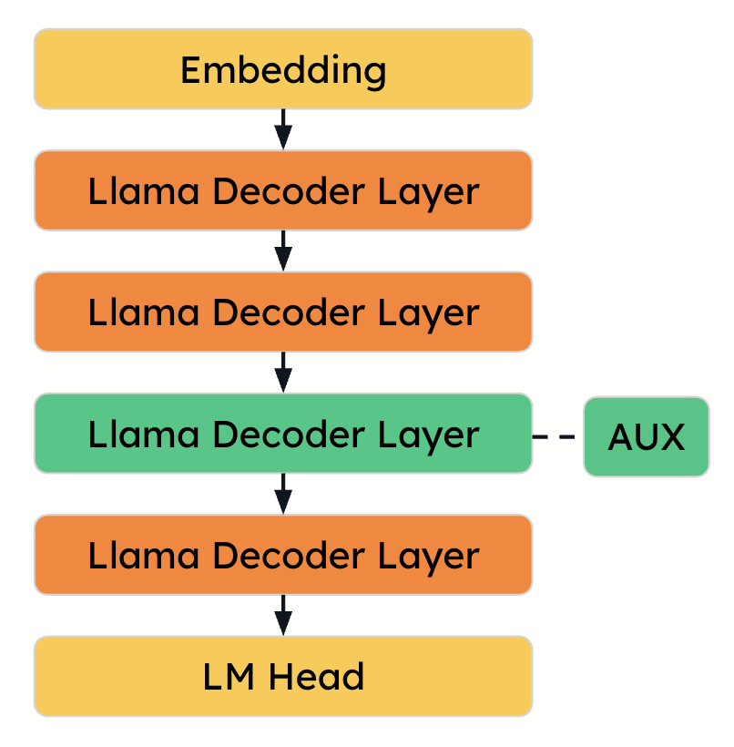

# Big Modeling with Sequential Onloading #
## What is Sequential Onloading? ##
Sequential onloading is a memory-efficient approach for compressing large language models (LLMs) using only a single GPU. Instead of loading the entire model into memory—which can easily require hundreds of gigabytes—this method loads and compresses one layer at a time. The outputs are offloaded before the next layer is processed, dramatically reducing peak memory usage while maintaining high compression fidelity.

<p align="center">
    
</p>

For more information, see the [RedHat AI blog post](https://developers.redhat.com/articles/2025/05/09/llm-compressor-optimize-llms-low-latency-deployments#generalizing_to_multimodal_and_moe_architectures) or the [LLM Compressor Office Hours Recording](https://www.youtube.com/watch?v=GrhuqQDmBk8).

## Using Sequential Onloading ##
Sequential onloading is enabled by default within LLM Compressor. To disable sequential onloading, add the `pipeline="basic"` argument to the LLM Compressor `oneshot` function call.

## Running Llama 3.3 70b ##
The Llama 3.3 70b is larger than 80 GB, surpassing the size of 1 A100. However, with sequential onloading, this model can still be quantized seamlessly using a single GPU.

### Code Walkthough

```python
model_id = "meta-llama/Llama-3.3-70B-Instruct"
model = AutoModelForCausalLM.from_pretrained(model_id, torch_dtype="auto", device_map=None)
```

The model is first loaded onto the `cpu`, as indicated through the use of `None` for the `device_map` argument in the `from_pretrained` method when loading the model.

```python
oneshot(
    model=model,
    dataset=ds,
    recipe=recipe,
    max_seq_length=MAX_SEQUENCE_LENGTH,
    num_calibration_samples=NUM_CALIBRATION_SAMPLES,
)
```
During `oneshot`, only one gpu is required which will be used to onload each layer for calibration in a sequential manner.

```python
dispatch_for_generation(model)
sample = tokenizer("Hello my name is", return_tensors="pt")
sample = {key: value.to("cuda") for key, value in sample.items()}
output = model.generate(**sample, max_new_tokens=100)
print(tokenizer.decode(output[0]))
```

Finally, we call `dispatch_for_generation` to evenly load the model across available devices (potentially offloading the model if required) and run sample generations on the newly quantized model.
