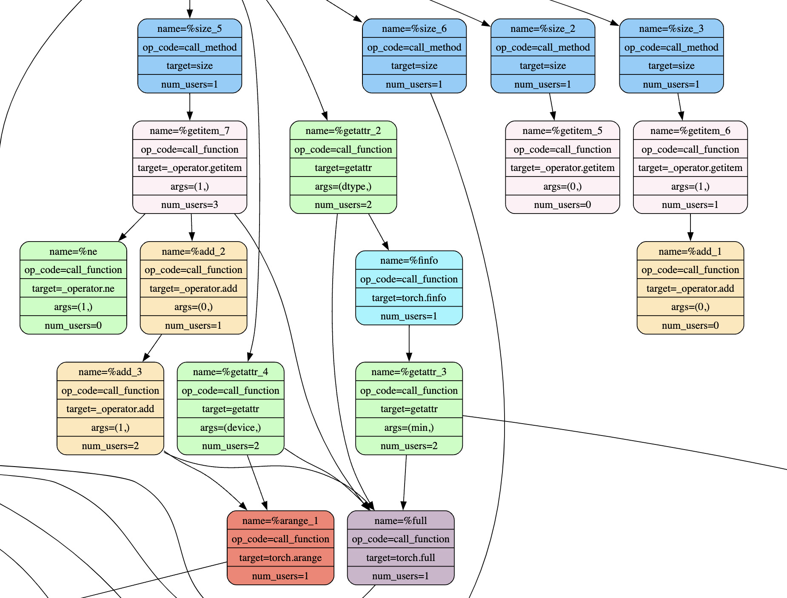
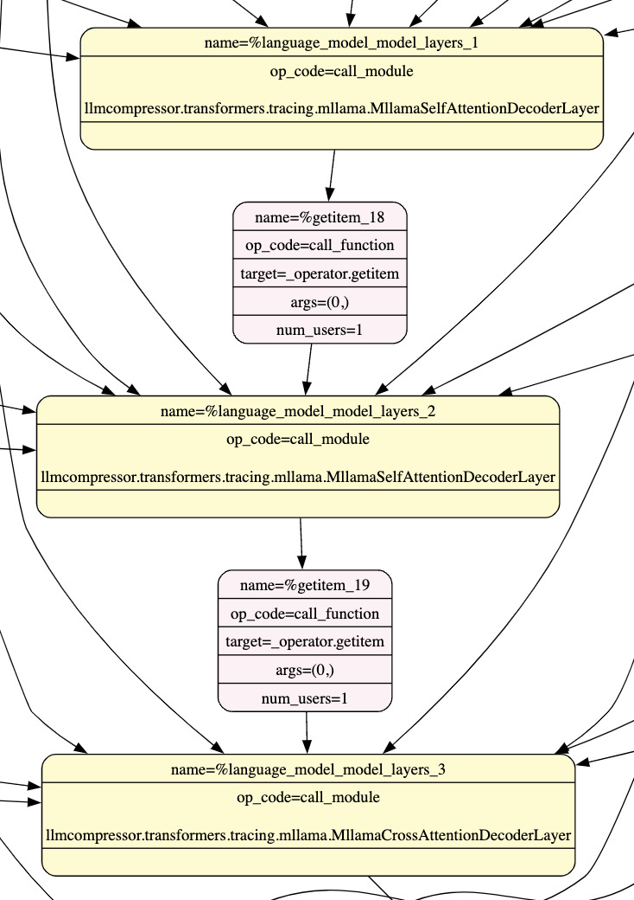
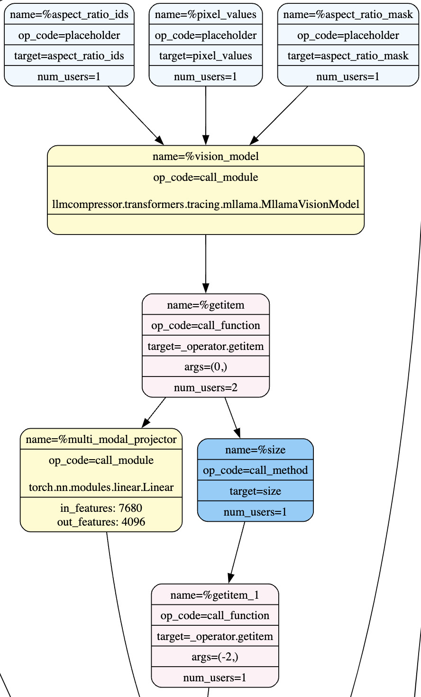
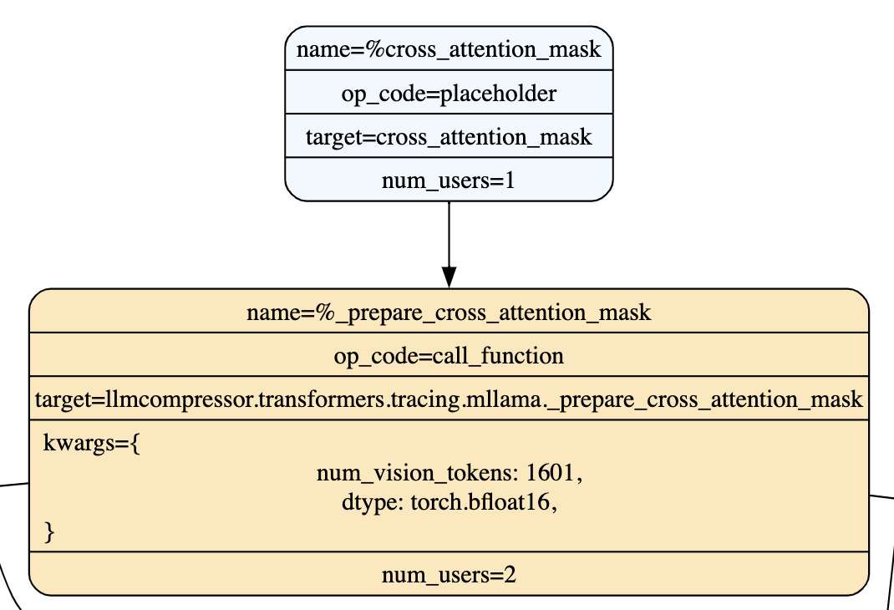

# Model Tracing Guide #
This guide explains the concepts of tracing as they relate to LLM Compressor and how to
modify your model to support recipes which require using the 
[Sequential Pipeline](/src/llmcompressor/pipelines/sequential/pipeline.py).

Through reading this guide, you will learn
1. Why tracing is required when compressing with recipes involving the
[Sequential Pipeline](/src/llmcompressor/pipelines/sequential/pipeline.py) and modifiers
such as [GPTQModifier](/src/llmcompressor/modifiers/quantization/gptq/base.py)
2. How to determine if your model is traceable for your dataset
3. How to modify your model definition to be traceable

## 1. Why is Tracing Required? ##
Due to the memory-intensive nature of some modifiers such as [GPTQModifier](/src/llmcompressor/modifiers/quantization/gptq/base.py)
and [SparseGPTModifier](/src/llmcompressor/modifiers/obcq/base.py), a [Sequential Pipeline](/src/llmcompressor/pipelines/sequential/pipeline.py)
is required in order to offload activations and reduce memory usage as well as propagate
the activation error induced by compression.

For example, let's say we want to quantize a basic `3` layer model using the
[GPTQModifier](/src/llmcompressor/modifiers/quantization/gptq/base.py) and `512`
calibration samples. The [Sequential Pipeline](/src/llmcompressor/pipelines/sequential/pipeline.py)
first identifies each of the layers (sequential targets) within the model. Then, the
pipeline runs each of the `512` samples, one sample at a time, through the first layer.
When one sample completes its forward pass through the layer, its activations recorded
by the [GPTQModifier](/src/llmcompressor/modifiers/quantization/gptq/base.py) via the
hessian and the layer output is offloaded to the cpu. After all `512` samples have been
passed through the layer, the [GPTQModifier](/src/llmcompressor/modifiers/quantization/gptq/base.py)
uses the recorded activations to compress the weights of the modules within the layer.
Once module compression is complete, the offloaded activations are used to perform the
forward pass of the next layer.

The [Sequential Pipeline](/src/llmcompressor/pipelines/sequential/pipeline.py) relies on
the ability to know what the inputs and outputs are of each model layer in order to
faithfully "replay" the model's forward pass one layer at a time. While assuming that
"the input to the next layer is the output of the previous layer" holds for most
decoder-only LLMs, this assumption breaks for more complex models such as
encoder-decoder architectures and models which pass RoPE embeddings as an input to each
layer. For this reason, in order to faithfully capture the data flow between model
layers, the model's call graph must be traced.

Tracing is done by sampling one batch from the provided dataset, capturing all
of the operations that are performed during the model forward pass, and encoding those
operations into a model graph which is then broken into sequential layers to be executed
independently at calibration time. For a visual example of a model call graph, see
[Llama_3.2-Vision.svg](/src/llmcompressor/transformers/tracing/assets/Llama_3.2-Vision.svg).

<p align="center">
    
</p>

## 2. Determining Traceability ##
In order to determine if a model is traceable for a given dataset, you can use the
`llmcompressor.trace` function. This function determines whether a model is
traceable for a given dataset, sequential targets list, and ignore list.

For example this script demonstrates that the `Qwen2-VL` model is traceable when
using inputs from a text-only dataset
```bash
llmcompressor.trace \
    --model_id Qwen/Qwen2-VL-2B-Instruct \
    --model_class Qwen2VLForConditionalGeneration \
    --sequential_targets Qwen2VLDecoderLayer \
    --ignore "lm_head" "re:visual.*"
```
```
Successfully traced model into 29 subgraphs!
```

However, attempting to trace the `Qwen2-VL` with multimodal inputs (text and images)
results in a `TraceError` due to untraceable operations within the `Qwen2-VL` model
definition
```bash
llmcompressor.trace \
    --model_id Qwen/Qwen2-VL-2B-Instruct \
    --model_class Qwen2VLForConditionalGeneration \
    --sequential_targets Qwen2VLDecoderLayer \
    --ignore "lm_head" "re:visual.*" \
    --multimodal_data
```
```
torch.fx.proxy.TraceError: symbolically traced variables cannot be used as inputs to control flow
```

### Choosing Sequential Targets ###
Sequential targets are the modules which determine the granularity of error propagation
and activation offloading when performing forward passes of the model. These are
typically the "transformer blocks" of the model, also referred to as "layers" with
llm-compressor.

Choosing sequential targets with higher granularity (for example `"Linear"` instead of
`"LlamaDecoderLayer"`) will result in fewer hessians being allocated at the same time,
decreasing the memory requirements for compression. This may also increase the recovered
accuracy of the model, as compression error is propagated at a higher granularity.
However, using higher granularity sequential targets may also increase compression time,
as more time is spent offloading and onloading activations.

<p align="center">
    
</p>

### Choosing Modules to Ignore ###
If your model is not traceable for your desired dataset, first consider adding any
problematic modules to the `ignore` list. Doing this prevents the model tracer from
tracing the internals of those modules, thereby avoid the untraceable operations.

For example, in this model graph, the internals of the `MllamaVisionModel` are not
traced (we don't see the individual `MllamaVisionEncoder` layers, ect.). However, we can
no longer target the modules within the `MllamaVisionModel` such as the
`MllamaVisionEncoder` as sequential targets. If any modules within the
`MllamaVisionModel` are being compressed, their hessians be all be allocated at the same
time, increasing peak memory usage.

<p align="center">
    
</p>

Note that in the image above, the `multi_modal_projector` is also ignored.

## 3. Defining your own Traceable Model Definitions ##
If you discover that your model is not traceable through `llm-compressor.trace`,
you may want to modify your model definition to make the model traceable. Before
attempting to define your own traceable model definition, make sure that the untraceable
parts of your model are not a part of a module that can be [ignored](#choosing-modules-to-ignore).

To define your own traceable model definition, follow the steps below:
1. Copy the original model definition into the [tracing folder](/src/llmcompressor/transformers/tracing/)
    * The original model definition can usually be found in the [`transformers/models`](https://github.com/huggingface/transformers/tree/main/src/transformers/models)
folder or the `modeling_X.py` file when using models with remote code.
2. Add your new model class to [tracing/\_\_init\_\_.py](/src/llmcompressor/transformers/tracing/__init__.py)
    * Make sure to alias your model name using the template `TraceableXForY`
3. Use `llm-compressor.trace` to find the untraceable line of code in your model
    * See [Determining Traceability](#2-determining-traceability) for an example
    * **Remember to replace `model_class` with your own model definition**
4. Find the untraceable line of code in your model definition and modify the code to
make it traceable
    * Examples of how to do this for each of the common errors can be found below
    * If you encounter a tracing issue which is not documented below, please create an issue!
5. Add a comment above the line which has been modified explaining why the operation is
untraceable
    * For example, `# TRACING: Assume that the attention mask is always present`
6. Repeat steps 3-5 until all of the untraceable operations have been replaced with
traceable operations
7. Once your model traces successfully, remove any class definitions you did not use and
import them if necessary
    * Note that this cannot be done for models with remote code, as all code is required
8. Commit your changes to a branch and open a pull request so that others like yourself can
benefit from the changes!
    * LLM Compressor is an open-source project that relies on community contribution to
    support the wide range of model architectures available on huggingface
    * P.S., remember to add `# vllm-project: no copyright` underneath any copyright
    notices at the top of the file

### Conditional Logic and Asserts ###
```
torch.fx.proxy.TraceError: symbolically traced variables cannot be used as inputs to control flow
```

Control flow statements often cause issues during tracing because symbolic variables,
ie inputs provided from the dataset sample, cannot be used as inputs to control flow.
To resolve these issues, you can replace the logic with an assumption which bypasses the
problematic control flow.

For example, the following block in [`LlavaForConditionalGeneration`](/src/llmcompressor/transformers/tracing/llava.py)
```python3
if n_image_tokens != n_image_features:
    raise ValueError(
        f"Image features and image tokens do not match: tokens: {n_image_tokens}, features {n_image_features}"
    )
```

Should be replaced with:
```python3
# TRACING: Assume that processing and tokenization was done correctly
# if n_image_tokens != n_image_features:
if False:
    raise ValueError(
        f"Image features and image tokens do not match: tokens: {n_image_tokens}, features {n_image_features}"
    )
```

### Conditional Iteration ###
```
torch.fx.proxy.TraceError: Proxy object cannot be iterated.
```

Because the size and contents of symbolic variables are subject to change at runtime,
symbolic variables cannot be iterated.

For example, this code block cannot be traced because it iterates through the contents
of `features`, a symbolically traced variable
```python3
accumulated_features = torch.zeros(config.model_dims)
for feature in features:
    accumulated_features += feature
```

In this instance, this block of code can be restructured to use a vector operation which
does not require explicit iteration through the `features` variable.
```python3
accumulated_features = torch.sum(features, dim=0)
```

However, in more complex instances, such as iterating through a list of images to
process each image, vectorization is not feasible. In these instances, wrapping the
parent function is highly recommended, see [Wrapping Functions](#wrapping-functions).

### Wrapping Functions ###
Wrapping is a technique whereby the internals of certain functions can be ignored from
tracing in the model graph

For example, when tracing the [`MllamaForConditionalGeneration`](/src/llmcompressor/transformers/tracing/mllama.py)
architecture, we encounter a `TraceError` on this line:
```python3
batch_size, text_total_length, *_ = cross_attention_mask.shape
```
```
torch.fx.proxy.TraceError: Proxy object cannot be iterated
```

In this case, making this line traceable is fairly trivial. However, since this function
does not output any variable whose shapes require inference
(see [Correcting Shape Inference](#correcting-shape-inference)), we can simply wrap the
function, effectively ignoring its untraceable internals.

```python3
@torch.fx.wrap
def _prepare_cross_attention_mask(...) -> ...:
    ...
    batch_size, text_total_length, *_ = cross_attention_mask.shape
    ...
```

<p align="center">
    
</p>

Please note that wrapped functions must be defined at the module-level, meaning that
class and instance methods must be hoisted to the module level, see
[Defining Your Own Functions to Wrap](#defining-your-own-functions-to-wrap)

In the future, support will be added for wrapping functions by name rather than
requiring the original function to be redefined. See [_symbolic_trace.py](https://github.com/pytorch/pytorch/blob/main/torch/fx/_symbolic_trace.py#L1246-L1247).

### Defining Your Own Functions to Wrap ###
Wrapping is not limited to functions already defined by the model definition. We can
also write our own functions to wrap if we want to wrap a particular chunk of code or
wrap a function which is defined a non-module level.

For example, this chunk of code iterates through a symbolic variable, which is
[not traceable](#conditional-iteration).
```python3
for idx, feature in enumerate(features):
    process_feature(idx, feature)
```
```
torch.fx.proxy.TraceError: Proxy object cannot be iterated
```

To resolve this, the iteration can be wrapped in a function that will not be traced.
```python3
@torch.fx.wrap
def process_all_features(features):
    for idx, feature in enumerate(features):
        process_feature(idx, feature)

process_all_features(features)
```

Make sure to define your new function at the top module-level and pass in any arguments
required by the function.

### Correcting Shape Inference ###
When tracing with LLM Compressor, the shapes of some variables are assumed based on the
shapes provided by a sample from the dataset. This is done to allow some models which
include basic [Conditional Logic and Asserts](#conditional-logic-and-asserts) to be
traceable without major changes to the model definition.

Shape assumptions are implemented by modifying the `HFProxy` instance, which is used as
a proxy for symbolic variables during tracing. The `_metadata` attribute of the
`HFProxy` instance is assigned to a meta tensor whose shape and dtype correspond to the
assumed shape and dtype of the symbolic variable.

However, there are some instances where the shape inference is not properly
implemented, leading to some variables whose shape is unknown. This can happen if the
proxy variable passes through an ignored module or wrapped function, or if a shape
inference is missing for a particular operation. This is not always a problem, unless
those variables are used for conditional logic later during execution. In these cases,
rather than fixing every instance of condition logic, we can inject our own knowledge of
variable shapes.

For example, when tracing the [LlavaForConditionalGeneration](/src/llmcompressor/transformers/tracing/llava.py)
architecture, we have a function which returns a variable `image_features` whose shape
is unknown (this is because `get_image_features` calls the `self.multi_modal_projector`,
which is typically part of the `ignore` list).
```python3
image_features = self.get_image_features(
    pixel_values=pixel_values,
    vision_feature_layer=vision_feature_layer,
    vision_feature_select_strategy=vision_feature_select_strategy,
)
```

`image_features` is later used for conditional logic, so it would be nice if this
variable had a known shape. Luckily, `get_image_features` includes documentation which
describes the known shape of its output.
```python3
Returns:
    image_features (`torch.Tensor`): Image feature tensor of shape `(num_images, image_length, embed_dim)`).
```

Using this information, we can define our own helper function to install the known shape
information as metadata into the `image_features` variable.
```python3
def maybe_install_metadata_image_features(
    image_features: Union[torch.Tensor, HFProxy],
    pixel_values: Union[torch.Tensor, HFProxy],
    config: LlavaConfig,
) -> Union[torch.Tensor, HFProxy]:
    if isinstance(image_features, HFProxy):
        # (num_images, image_length, embed_dim)
        num_images = pixel_values._metadata.size(0)
        image_length = config.image_seq_length
        embed_dim = config.vision_config.intermediate_size

        original_fn = image_features.tracer.patched_torch_methods["empty"][1]
        metadata = original_fn(
            (num_images, image_length, embed_dim), device=torch.device("meta")
        )
        image_features.install_metadata(metadata)

    return image_features
```

The new function is inserted after the `get_image_features`
```
image_features = self.get_image_features(
    pixel_values=pixel_values,
    vision_feature_layer=vision_feature_layer,
    vision_feature_select_strategy=vision_feature_select_strategy,
)

image_features = maybe_install_metadata_image_features(
    image_features, pixel_values, self.config
)
```

In another example from [LlavaForConditionalGeneration](/src/llmcompressor/transformers/tracing/llava.py),
we find that shape inference for the `torch.Tensor.masked_scatter` function has not been
implemented. We can determine the shape of this function's output by simulating it using
the existing metadata.
```python3
def maybe_install_metadata_inputs_embeds(
    inputs_embeds_masked: Union[torch.Tensor, HFProxy],
    inputs_embeds: Union[torch.Tensor, HFProxy],
    special_image_mask: Union[torch.Tensor, HFProxy],
    image_features: Union[torch.Tensor, HFProxy],
) -> Union[torch.Tensor, HFProxy]:
    if isinstance(inputs_embeds_masked, HFProxy):
        metadata = inputs_embeds._metadata.masked_scatter(
            special_image_mask._metadata.to(bool), image_features._metadata
        )
        inputs_embeds_masked.install_metadata(metadata)

    return inputs_embeds

...
inputs_embeds_masked = inputs_embeds.masked_scatter(special_image_mask, image_features)
inputs_embeds_masked = maybe_install_metadata_inputs_embeds(
    inputs_embeds_masked, inputs_embeds, special_image_mask, image_features
)
...
```

### Ensuring Consistent Data Types ###
```
TypeError: __bool__ should return bool, returned Tensor
```

In rare cases, some variables are assigned to a different type than the type they were
initialized with. This is a problem for the torch.fx tracing module, as the
implementation requires that all variables maintain the same type.

In this case, the variable `legacy_processing` is initially assigned to the `bool` type.
However, it is later reassigned to the type `torch.Tensor[bool]`.
```python3
legacy_processing = False
...
legacy_processing = (
    (input_ids == self.config.image_token_index).sum(1).max() < self.config.image_seq_length
) or (input_ids.shape[-1] == 1 and pixel_values is not None)
```

In this example, we can fix the type of `legacy_processing` by ensuring that the new
assignment matches the original type `bool`.
```python3
legacy_processing = False
...
legacy_processing = (
    (input_ids == self.config.image_token_index).sum(1).max() < self.config.image_seq_length
) or (input_ids.shape[-1] == 1 and pixel_values is not None).item()
```